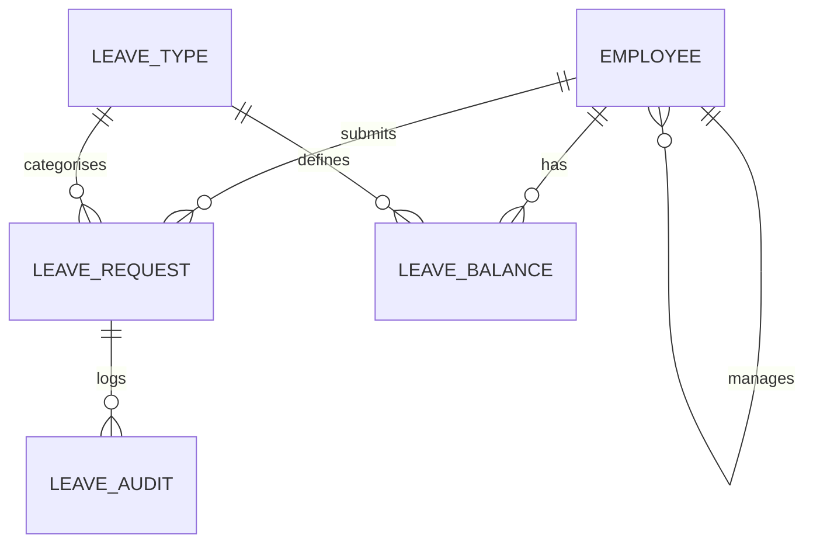

# Employee Leave Management

A leave management system for small and mid-sized businesses, built with **C#**, **ASP.NET Core MVC** and an **Oracle** database. Employees request leave, managers approve or reject it, and HR keeps track of balances and reports. The business rules (overlap checks, balances, approver permissions) are enforced in the database with stored procedures, so the data stays consistent no matter which application talks to it.

> **Status:** work in progress. The Oracle database layer is complete. The web application is being built on top of it.

## Features

**Database (done)**
- Leave requests with automatic working-day calculation that skips weekends and public holidays
- Approval workflow: only the line manager or HR can approve, and nobody can approve their own request
- Balance protection: pending requests count against the balance, and approval deducts it in a single transaction
- Overlap detection so an employee cannot book two periods on the same days
- Cancellation with automatic balance refund for approved leave that has not started
- Audit trail of every status change, written by a trigger
- Reporting views for pending requests, the team calendar and a department summary

**Web application (planned)**
- Role-based screens for Employee, Manager and HR
- Leave request form with live balance display
- Manager dashboard with pending approvals
- Team leave calendar
- HR screens for employees, leave types and entitlements
- Unit tests for the service layer

## Tech stack

| Area | Technology |
|---|---|
| Language | C# |
| Web framework | ASP.NET Core MVC |
| Database | Oracle Database 12c or newer (developed on Oracle XE) |
| Data access | ODP.NET (Oracle.ManagedDataAccess.Core) |
| Tools | Visual Studio, Oracle SQL Developer, Git and GitHub |

## Database design



| Table | Purpose |
|---|---|
| `EMPLOYEE` | Staff, their department, role and line manager |
| `LEAVE_TYPE` | Annual, sick, family responsibility and study leave |
| `LEAVE_BALANCE` | Days remaining per employee, leave type and year |
| `PUBLIC_HOLIDAY` | Dates excluded from working-day counts |
| `LEAVE_REQUEST` | Requests and their status (pending, approved, rejected, cancelled) |
| `LEAVE_AUDIT` | History of status changes |

Stored procedures: `sp_submit_leave`, `sp_approve_leave`, `sp_reject_leave`, `sp_cancel_leave`, plus the function `fn_working_days`.

## Project structure

```
Employee-Leave-Management/
  database/              Oracle scripts, run in numbered order
  LeaveManagement.Web/   ASP.NET Core MVC application
  README.md
  LICENSE
```

## Getting started

### Prerequisites
- Oracle Database 12c or newer (Oracle XE is free)
- Oracle SQL Developer (or any Oracle SQL client)
- Visual Studio with the ASP.NET and web development workload
- .NET SDK (the version used by the project)

### 1. Create the database user

Connect as an administrator (for example `SYSTEM`) to your pluggable database and run:

```sql
CREATE USER leavemgmt IDENTIFIED BY "<choose-a-password>";

GRANT CREATE SESSION, CREATE TABLE, CREATE VIEW, CREATE SEQUENCE,
      CREATE PROCEDURE, CREATE TRIGGER TO leavemgmt;

ALTER USER leavemgmt QUOTA UNLIMITED ON USERS;
```

### 2. Run the scripts

Connect as `leavemgmt` and run each file in the `database` folder with **Run Script (F5)**, in this order:

1. `01_tables.sql`
2. `02_triggers_views.sql`
3. `03_procedures.sql`
4. `04_seed_data.sql`
5. `05_test_queries.sql` (optional checks and negative tests)

The seed script adds demo employees, leave types, 2026 South African public holidays and sample requests. Please verify the holiday dates against the official list before using them for anything real.

### 3. Configure the connection string

Do not commit credentials. Store the connection string with .NET User Secrets:

```
dotnet user-secrets set "ConnectionStrings:OracleDb" "User Id=leavemgmt;Password=<your-password>;Data Source=<host>:1521/<service-name>"
```

## Business rules

| Rule | Where it is enforced |
|---|---|
| End date cannot be before start date | Check constraint and stored procedure |
| Requests cannot span two calendar years | `sp_submit_leave` |
| Requests must contain at least one working day | `sp_submit_leave` |
| No overlapping pending or approved leave | `sp_submit_leave` |
| Request cannot exceed available balance | `sp_submit_leave` |
| Only the line manager or HR can approve or reject | `sp_approve_leave`, `sp_reject_leave` |
| Rejections require a comment | `sp_reject_leave` |
| Balance cannot go negative | Check constraint on `LEAVE_BALANCE` |

## Author

Built by [shaveenmm](https://github.com/shaveenmm).
